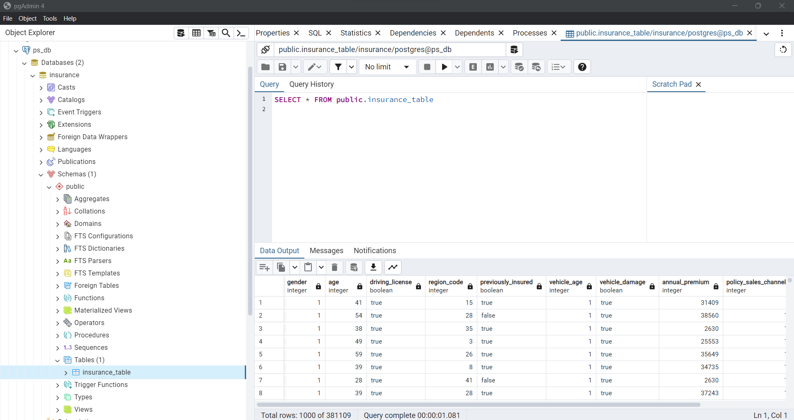

# ETL Pipeline for Insurance Data using PySpark and Docker

## Overview

This project demonstrates an ETL (Extract, Transform, Load) pipeline to process insurance data from a CSV file, transform it using PySpark, and load it into a PostgreSQL database. Docker is utilized for containerization, ensuring seamless deployment across environments.

## Prerequisites

Before running the ETL pipeline, make sure you have the following installed:

- Docker
- Docker Compose
- Python
- PySpark
- PostgreSQL

## Setup

1. Clone the repository:

    ```bash
    git clone https://github.com/thiphan94/ETL.git
    cd ETL
    ```

2. Create a PostgreSQL database and update the configuration:

    - Open `docker-compose.yml` and update the environment variables for PostgreSQL:
    
        ```yaml
        environment:
          POSTGRES_DB: your_database_name
          POSTGRES_USER: your_username
          POSTGRES_PASSWORD: your_password
        ```
3. Start the Docker containers (docker-compose setup with PostgreSQL and pgAdmin4):

    ```bash
    docker-compose up 
    ```

4. In pgAdmin, we need to add a new server using the username and password which we have defined inside the docker file. 

## Project Structure

- `data/`: Contains the input CSV file.
- `src/`: Scripts for ETL processing: etl.py which uses the functions from extract.py, transform.py and load.py.
- `docker-compose.yml`: Docker Compose configuration for the project.
- `Readme.md`: Project documentation.

## Usage

- Download the [Health Insurance Cross Sell Prediction dataset](https://www.kaggle.com/datasets/anmolkumar/health-insurance-cross-sell-prediction?select=train.csv) from Kaggle.
- Place the downloaded CSV file into the `data/` directory.
- Run etl 
    ```bash
    python src/etl.py
    ```
- We can check in pgAdmin if the dataset is loaded correctly in PostgreSQL:

## Dataset

The dataset used in this project is the [Health Insurance Cross Sell Prediction](https://www.kaggle.com/datasets/anmolkumar/health-insurance-cross-sell-prediction?select=train.csv) dataset available on Kaggle. 

- **File**: `train.csv`
- **Columns**: 
  - `id`: Unique identifier for each customer
  - `gender`: Gender of the customer
  - `age`: Age of the customer
  - `driving_license`: Whether the customer has a driving license (1 for Yes, 0 for No)
  - ... (Include other relevant columns)
- [More information about the dataset](https://www.kaggle.com/datasets/anmolkumar/health-insurance-cross-sell-prediction/data)

## Notes

- Make sure to customize the PostgreSQL database configuration in `docker-compose.yml`.
- Modify PySpark scripts to match your data schema and transformation requirements.

## Credits

- [PySpark Documentation](https://spark.apache.org/docs/latest/sql-getting-started.html)
- [Docker Documentation](https://docs.docker.com/)
- [PostgreSQL Documentation](https://www.postgresql.org/docs/)
